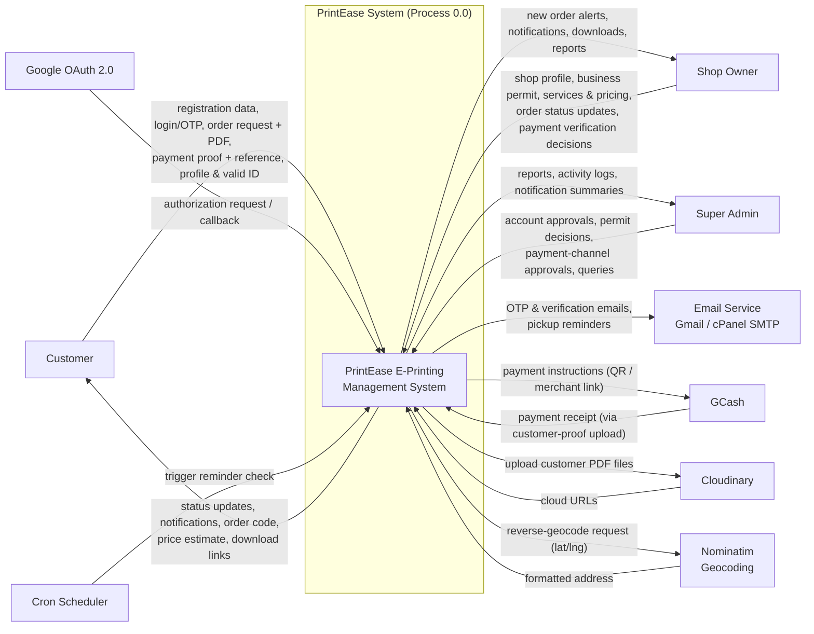

# PrintEase — Context Diagram

## 1. Purpose

The context diagram shows the **PrintEase E-Printing Management System** as a single process (Process 0.0) and all the **external entities** it interacts with, plus the **data flows** that cross the system boundary. It is the highest level of the analysis model and matches the system described in `docs/CHATGPT_SYSTEM_CONTEXT.md`.

External entities:

| ID | External Entity | Description |
|---|---|---|
| E1 | **Customer** | Registers, browses shops, places print requests, uploads files, pays via GCash, tracks orders. |
| E2 | **Shop Owner** | Registers, sets up shop profile + business permit, manages services/pricing, processes jobs, verifies payments. |
| E3 | **Super Admin** | Verifies accounts/permits, approves payment channels, manages users/shops, views reports and audit logs. |
| E4 | **Google OAuth 2.0** | Third-party identity provider for social sign-in. |
| E5 | **Email Service** (Gmail / cPanel SMTP) | Delivers OTP codes, registration, and pickup-reminder emails. |
| E6 | **GCash** | Payment platform; the system presents QR/merchant-link details and verifies uploaded proof images. |
| E7 | **Cloudinary** | Cloud file storage for customer print-file uploads (PDFs). |
| E8 | **Nominatim (OpenStreetMap)** | Reverse-geocoding of shop coordinates to human-readable addresses. |
| E9 | **Cron Scheduler** | Triggers the pickup-reminder check. |

## 2. Context Diagram

## 3. Data Flow Table

| # | Data Flow | Source (From) | Destination (To) | Description |
|---|---|---|---|---|
| DF1 | Registration & login credentials | Customer / Shop Owner | System | Email, password, OTP; creates `users` record. |
| DF2 | Social sign-in | Google OAuth 2.0 | System | Identity assertion for Google login; links `user_social_accounts`. |
| DF3 | Order request + print file | Customer | System | Service/paper/copies/pickup data + uploaded PDF; creates `orders` + `uploaded_files`. |
| DF4 | Payment proof + reference no. | Customer (via receipt) | System | GCash screenshot and reference number; feeds OCR + `payments`. |
| DF5 | Shop profile + business permit | Shop Owner | System | Shop info, coordinates, logo, permit image; drives `print_shops.permit_status`. |
| DF6 | Services & pricing update | Shop Owner | System | Service types, document/flexible pricing, custom services. |
| DF7 | Payment channel details | Shop Owner | System | GCash QR or merchant link for approval (`shop_payment_channels`). |
| DF8 | Order status update | Shop Owner | System | Advances pending → processing → ready_for_pickup → completed. |
| DF9 | Payment verification decision | Shop Owner | System | Verify/reject proof with reason (`payments.verification_status`). |
| DF10 | Account / permit / channel decisions | Super Admin | System | Approve/reject users, permits, and payment channels. |
| DF11 | Status updates & notifications | System | Customer / Shop Owner | Push-flags and `notifications` rows surfaced by polling. |
| DF12 | OTP / verification / reminder emails | System | Email Service | Sent via PHPMailer (`helper/mailer.php`). |
| DF13 | Reverse-geocode request / address | System / Nominatim | System | `geocode_cache` lookup with Nominatim fallback. |
| DF14 | Reminder trigger | Cron Scheduler | System | Runs `pickup_reminder_checker.php`; updates `pickup_reminder_sent`. |
| DF15 | Reports & activity logs | System | Super Admin | Platform metrics, transaction summaries, audit trail (`activity_logs`). |

> Note: although GCash is listed as an external entity, no payment gateway API is used. The customer completes the transfer inside the GCash app; the system only displays payment instructions and verifies the uploaded proof screenshot (optionally OCR-assisted).