# PrintEase — Data Model (ERD + Relational)

## 1. Purpose

The data model defines the **entities, attributes, and relationships** that back the PrintEase system. It corresponds 1:1 to the schema in `docs/CHATGPT_DB_SCHEMA_ONLY.sql` (21 tables). Notation: `||` = exactly one, `o{` = zero-or-many, `|{` = one-or-many.

## 2. Entity Relationship Diagram

```mermaid
erDiagram
    USERS ||--o{ PRINT_SHOPS : "owns (owner_id)"
    USERS ||--o{ ORDERS : "places (customer_id)"
    USERS ||--o{ NOTIFICATIONS : "receives (user_id)"
    USERS ||--o{ ACTIVITY_LOGS : "triggers (user_id)"
    USERS ||--o{ USER_REMEMBER_TOKENS : "has (user_id)"
    USERS ||--o{ USER_SOCIAL_ACCOUNTS : "links (user_id)"
    USERS ||--o{ LOGIN_ATTEMPTS : "blocks (email/ip)"
    USERS ||--o{ CUSTOMER_FAVORITE_SHOPS : "favorites (customer_id)"

    PRINT_SHOPS ||--o{ CUSTOMER_FAVORITE_SHOPS : "has (shop_id)"
    PRINT_SHOPS ||--o{ ORDERS : "receives (shop_id)"
    PRINT_SHOPS ||--o{ SHOP_SERVICE_TYPES : "offers (shop_id)"
    PRINT_SHOPS ||--o{ SHOP_PRICE_RECORDS : "prices (shop_id)"
    PRINT_SHOPS ||--o{ SHOP_SERVICES : "legacy prices (shop_id)"
    PRINT_SHOPS ||--o{ SHOP_SERVICE_PRICING : "legacy options (shop_id)"
    PRINT_SHOPS ||--o{ SHOP_CUSTOM_SERVICES : "custom items (shop_id)"
    PRINT_SHOPS ||--o{ SHOP_PAYMENT_CHANNELS : "channels (shop_id)"
    PRINT_SHOPS ||--o{ SHOP_PAYMENT_SETTINGS : "legacy settings (shop_id)"
    PRINT_SHOPS ||--o{ SHOP_PAYMENT_ACCOUNTS : "legacy accounts (shop_id)"

    ORDERS ||--o{ PAYMENTS : "has (order_id)"
    ORDERS ||--o{ UPLOADED_FILES : "has (order_id)"

    USERS ||--o{ PAYMENTS : "verified_by"
    USERS ||--o{ SHOP_PAYMENT_CHANNELS : "approved_by"
```

## 3. Entity Table (attributes, primary/foreign keys)

| Entity | Table | Primary Key | Foreign Keys | Key Attributes / Notes |
|---|---|---|---|---|
| User | `users` | `user_id` | — | `full_name`, `email` (unique), `password` (bcrypt), `role` (customer/shop_owner/super_admin), `account_status`, `phone_number`, `address`, `latitude/longitude`, `valid_id_front/back_file`, `profile_picture`, `auth_version`, `otp_code`, `otp_expires` |
| Print Shop | `print_shops` | `shop_id` | `owner_id → users.user_id` | `shop_name`, `shop_address`, `display_address`, `landmark`, `latitude/longitude`, `business_permit_file`, `shop_logo`, `shop_status`, `permit_status` (pending/verified/rejected/disabled), weekday/weekend hours |
| Order | `orders` | `order_id` | `customer_id → users`, `shop_id → print_shops` | `order_code` (PE-YYYYMMDD-XXXXXX), `submit_token`, paper size/type/print type, `copies`, `page_count`, `pickup_datetime`, `order_status` (pending/processing/ready_for_pickup/completed/cancelled), `total_amount`, `service_category`, `custom_service_id`, `customer_deleted_at` (soft delete) |
| Payment | `payments` | `payment_id` | `order_id → orders`, `customer_id → users`, `verified_by → users` | `amount`, `payment_method` (gcash_direct/gcash_merchant_link), `reference_number`, `ocr_reference_number`, `ocr_payment_date`, `payment_reference_match`, `proof_of_payment_file`, `payment_status`, `verification_status`, `rejection_reason`, `paid_at` |
| Uploaded File | `uploaded_files` | `file_id` | `order_id → orders` | `file_name`, `file_path` (Cloudinary URL), `file_type`, `cloudinary_public_id` |
| Service Type | `shop_service_types` | `id` | `shop_id → print_shops` | `service_type` (Document Printing, Photo Printing, Lamination…), `service_offered`, `online_available`, `customer_note` |
| Price Record | `shop_price_records` | `id` | `shop_id → print_shops` | `service_type`, `size_name`, `variant`, dimensions, `pricing_basis`, `min/max_quantity`, `price`, `is_available`, `legacy_source`/`legacy_id` |
| Legacy Service | `shop_services` | `service_id` | `shop_id → print_shops` | Per-page document printing: `paper_size`, `paper_type`, `print_type`, `price_per_page` |
| Legacy Pricing | `shop_service_pricing` | `id` | `shop_id → print_shops` | `service_type`, `option_size`, `option_label`, `variant`, `unit`, `price` |
| Custom Service | `shop_custom_services` | `id` | `shop_id → print_shops` | `service_type`, `service_name`, `unit_price`, `unit_label`, `is_available` |
| Payment Channel | `shop_payment_channels` | `id` | `shop_id → print_shops`, `approved_by → users` | `channel` (gcash_qr/gcash_merchant_link), name/number/QR/merchant_link, `approval_status`, `rejected_reason`, `is_active` |
| Notification | `notifications` | `notification_id` | `user_id → users` | `type`, `title`, `message`, `target_url`, `metadata_json`, `is_read`, `read_at` |
| Activity Log | `activity_logs` | `log_id` | `user_id → users` | `action`, `module`, `target_type/id`, `old_value`, `new_value` (JSON), `ip_address`, `user_agent` |
| Favorite | `customer_favorite_shops` | `id` | `customer_id → users`, `shop_id → print_shops` | Composite customer↔shop association. |
| Remember Token | `user_remember_tokens` | `remember_token_id` | `user_id → users` | `selector`, `validator_hash`, `auth_provider`, `remember_duration_days`, `expires_at` |
| Social Account | `user_social_accounts` | `social_account_id` | `user_id → users` | `provider`, `provider_user_id`, `provider_email` |
| Login Attempt | `login_attempts` | `id` | — | `email`, `ip_address`, `attempts`, `last_attempt`, `blocked_until` |
| Rate Limit Event | `rate_limit_events` | `id` | — | `action`, `identifier`, `ip_address`, `attempt_count`, `window_started_at`, `blocked_until` |
| Geocode Cache | `geocode_cache` | `id` | — | `lat`, `lng`, `address` (Nominatim cache) |

> Legacy tables (`shop_services`, `shop_service_pricing`, `shop_payment_settings`, `shop_payment_accounts`) still exist for backward compatibility; new code uses `shop_price_records` and `shop_payment_channels`.

## 4. Integrity Rules

1. **Referential integrity** — enum-driven statuses everywhere: account (`incomplete|pending|verified|rejected|inactive`), permit (`pending|verified|rejected|disabled`), order (`pending|processing|ready_for_pickup|completed|cancelled`), payment/verification (`pending|verified|rejected`), channel approval (`pending|approved|rejected`).
2. **One owner per shop lifecycle** — `print_shops.owner_id` is unique-ish by design; an owner manages one shop at a time.
3. **Order uniqueness** — `order_code` is unique; `submit_token` is a one-time 32-char random used to view a pending order before login.
4. **Payment lock** — `payments.active_lock_order_id` prevents the same proof being attached to multiple orders.
5. **Cascade delete** — `shop_payment_channels` deletes with its shop (`ON DELETE CASCADE`).
6. **Soft delete** — completed orders removed by customer set `customer_deleted_at` instead of row deletion.
7. **Session invalidation** — a changed `users.auth_version` invalidates earlier "remember" tokens.
8. **Audit/notification consistency** — every state change writes an `activity_logs` row and, where user-facing, a `notifications` row.