# PrintEase — Functional Decomposition Diagram (FDD)

## 1. Purpose

The **Functional Decomposition Diagram (FDD)** breaks the PrintEase system's functionality into a hierarchy of modules and sub-functions grouped by role. Each leaf maps to the concrete page/action that implements it.

## 2. FDD Tree

```mermaid
flowchart TD
    PE["PrintEase System"]

    PE --> L1["1.0 Account & Authentication"]
    L1 --> L11["1.1 Registration (email + OTP)"]
    L1 --> L12["1.2 Verification (OTP / account)"]
    L1 --> L13["1.3 Login / Remember-me / Logout"]
    L1 --> L14["1.4 Social sign-in (Google OAuth)"]
    L1 --> L15["1.5 Forgot / reset password"]
    L1 --> L16["1.6 Profile & valid ID"]

    PE --> L2["2.0 Customer"]
    L2 --> L21["2.1 Explore shops (all / nearby / favorites)"]
    L2 --> L22["2.2 Favorite shops"]
    L2 --> L23["2.3 Place order (file upload + options)"]
    L2 --> L24["2.4 Pay via GCash (proof upload)"]
    L2 --> L25["2.5 Track orders"]
    L2 --> L26["2.6 Notifications"]
    L2 --> L27["2.7 Manage profile (delete completed orders)"]

    PE --> L3["3.0 Shop Owner"]
    L3 --> L31["3.1 Shop profile & operating hours"]
    L3 --> L32["3.2 Business permit submission"]
    L3 --> L33["3.3 Services & pricing management"]
    L3 --> L34["3.4 GCash payment channels"]
    L3 --> L35["3.5 Print job lifecycle + downloads"]
    L3 --> L36["3.6 Payment verification (OCR-assisted)"]
    L3 --> L37["3.7 Transactions & reports"]
    L3 --> L38["3.8 Availability status"]

    PE --> L4["4.0 Super Admin"]
    L4 --> L41["4.1 Manage users (verify / deactivate)"]
    L4 --> L42["4.2 Manage shops & permits"]
    L4 --> L43["4.3 Approve payment channels"]
    L4 --> L44["4.4 Platform reports"]
    L4 --> L45["4.5 Activity logs"]
    L4 --> L46["4.6 Notifications & settings"]

    PE --> L5["5.0 Cross-cutting Services"]
    L5 --> L51["5.1 Live update polling"]
    L5 --> L52["5.2 OCR reference detection"]
    L5 --> L53["5.3 Geocoding (reverse)"]
    L5 --> L54["5.4 Pickup reminders (cron)"]
    L5 --> L55["5.5 Email delivery (PHPMailer)"]
    L5 --> L56["5.6 Security & audit (CSRF, CSP, rate limit, guards)"]
```

## 3. Module → Implementation Map

| FDD Leaf | Page(s) | Action / Handler(s) |
|---|---|---|
| 1.1 Registration | `frontend/pages/register.php`, `verify_otp.php` | `register_process.php`, `send_otp.php` |
| 1.2 Verification | `verify_registration.php`, `verify_otp.php` | `verify_otp.php`, `verify_registration.php` |
| 1.3 Login / Remember / Logout | `login.php` | `login_process.php`, `logout.php`, `backend/includes/remember_auth.php` |
| 1.4 Social sign-in | `pages/social_role.php`, `oauth/oauth_callback.php` | `oauth_start.php`, `oauth_callback.php`, `social_register_process.php` |
| 1.5 Password reset | `forgot_password.php`, `reset_password.php` | `send_otp.php`, `reset_password_process.php` |
| 1.6 Profile & valid ID | `user/customer/profile.php` | `save_customer_profile.php`, `change_customer_password.php`, `change_owner_password.php`, `change_admin_password.php` |
| 2.1 Explore shops | `explore.php`, `shops.php`, `shopLocation.php` | `live_search.php`, `reverse_geocode.php` |
| 2.2 Favorites | `explore.php`, `shops.php` | `toggle_favorite_shop.php` |
| 2.3 Place order | `place_order.php` | `submit_order.php`, `pending_order_token.php`, `shop_service_type_feed.php` |
| 2.4 Pay via GCash | `payment.php` | `submit_payment_proof.php`, `detect_payment_reference.php` |
| 2.5 Track orders | `orders.php` | `delete_customer_completed_order.php`, feeds |
| 2.6 Notifications | `notifications.php` | `notification_feed.php`, `mark_notification_read.php` |
| 2.7 Delete completed orders | `orders.php` | `delete_customer_completed_order.php` |
| 3.1 Shop profile | `shop_profile.php` | `save_shop_profile.php`, `reverse_geocode.php` |
| 3.2 Business permit | `shop_profile.php` | `save_shop_profile.php` (`permit_status=pending`) |
| 3.3 Services & pricing | `services.php` | `add/update/delete/toggle_service.php`, `add/update/delete/toggle_service_pricing.php` |
| 3.4 GCash channels | `payments.php` | `update_payment_settings_status.php` |
| 3.5 Print jobs | `orders.php` | `update_order_status.php`, `decline_order.php`, `download_order_file.php` |
| 3.6 Payment verification | `orders.php`, `payments.php` | `verify_payment.php`, `detect_payment_reference.php` |
| 3.7 Transactions & reports | `transactions.php`, `reports.php` | (page-side queries) |
| 3.8 Availability | `update_status.php` | `update_shop_status.php` |
| 4.1 Manage users | `manage_users.php` | `update_user_status.php` |
| 4.2 Manage shops & permits | `manage_print_shops.php` | `update_permit_status.php` |
| 4.3 Approve channels | `manage_print_shops.php` | `update_payment_settings_status.php` |
| 4.4 Platform reports | `reports.php` | (page-side queries) |
| 4.5 Activity logs | `activity_logs.php` | feeds |
| 4.6 Notifications & settings | `notifications.php`, `settings.php` | `notification_feed.php`, `mark_notification_read.php` |
| 5.1 Live polling | all dashboards | `notification_feed.php`, `owner_order_feed.php` via `frontend/assets/js/live-updates.js` |
| 5.2 OCR detection | `payment.php` | `detect_payment_reference.php`, `backend/includes/gcash_ocr.php`, `test_vision_api.php`, `backfill_payment_ocr.php` |
| 5.3 Geocoding | `shop_profile.php`, `explore.php` | `reverse_geocode.php` + `geocode_cache` |
| 5.4 Pickup reminders | cron | `pickup_reminder_checker.php` |
| 5.5 Email | (page-side) | `backend/helper/mailer.php` (OTP, verification, reminders) |
| 5.6 Security & audit | (all) | `session.php`, `security_headers.php`, `rate_limit.php`, `auth.php`, guards, `backend/includes/*` |

> All backend action filenames live under `backend/actions/` unless otherwise noted.