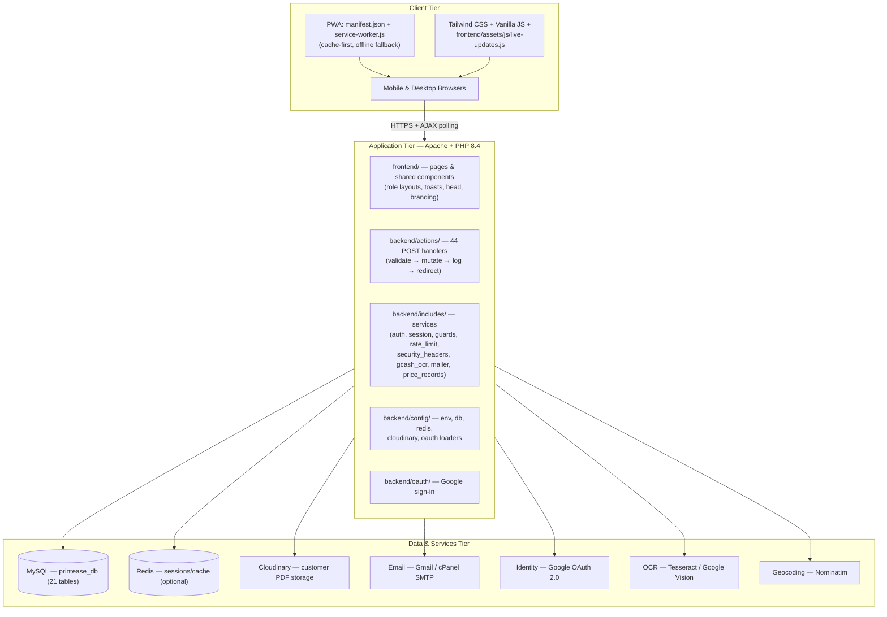
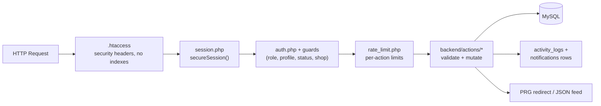
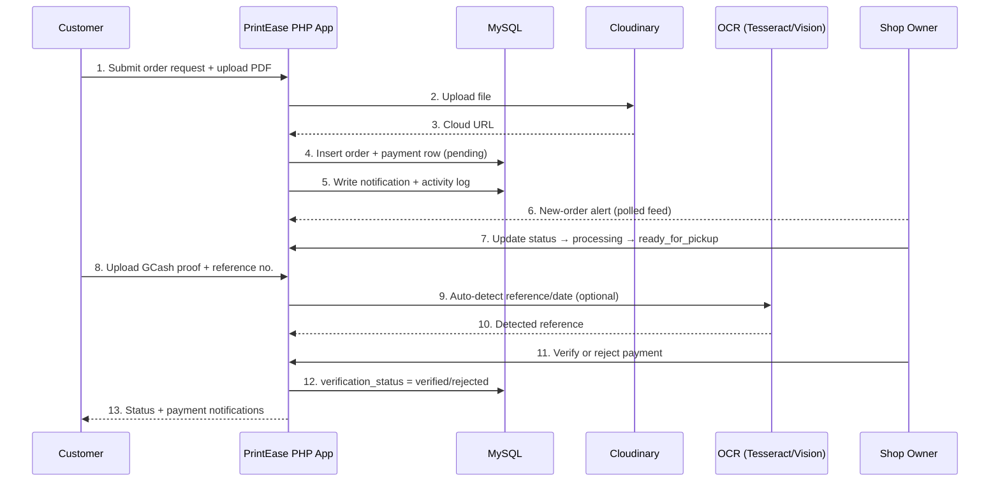
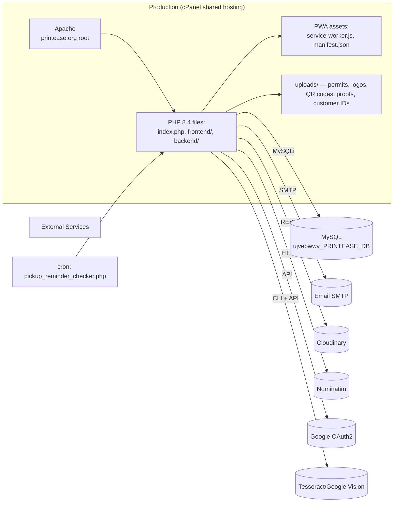

# PrintEase — System Architecture Design

## 1. Overview

PrintEase uses a **3-tier client–server architecture** over `HTTPS`:

- **Client Tier** — responsive PWA (mobile-first) running in any browser; vanilla JS, Tailwind CSS, live polling, offline caching.
- **Application Tier** — Apache + procedural PHP 8.4 (no framework). Pages (`frontend/`) render HTML; POST handlers (`backend/actions/`) process forms; shared services live in `backend/includes/`.
- **Data & Services Tier** — MySQL (primary store), optional Redis (sessions/cache), plus external SaaS: Cloudinary (files), Gmail/cPanel SMTP (email), Google OAuth2 (identity), Tesseract/Google Vision (OCR), Nominatim (geocoding).

## 2. Layered Architecture

## 3. Component View (request handling)

## 4. End-to-End Order & Payment Sequence

## 5. Deployment Architecture

Deployment facts:
- Base URL `https://printease.org/`; production config reads from `.env` (`APP_ENV=production`, `BASE_URL`, cPanel SMTP — Gmail SMTP is blocked on z.com).
- MySQL is on the shared host (`ujvepwwv_PRINTEASE_DB`); no Redis in production (session file fallback).
- Customer PDFs go to Cloudinary; all other uploads stay in local `uploads/<category>/`.
- `.htaccess` denies `.env`, composer files, and directory listing; adds security headers.
- `TRUSTED_PROXIES` stays unset so rate limiting keys on `REMOTE_ADDR`.

## 6. Security Architecture

| Layer | Mechanism | Where |
|---|---|---|
| Transport | HTTPS only; HSTS-style headers via `.htaccess` | server |
| Headers | CSP with nonces, `X-Frame-Options: DENY`, `nosniff`, Referrer-Policy, Permissions-Policy | `backend/includes/security_headers.php` |
| Session | `secureSession()`; Redis with file fallback; `SESSION_LIFETIME_DAYS` sliding window | `backend/includes/session.php` |
| Authentication | bcrypt passwords, OTP (email), Google OAuth, remember-me selector:validator tokens, `auth_version` revocation | `auth.php`, `remember_auth.php`, `backend/oauth/` |
| Authorization | role guards + profile/status/shop guards; ownership checks (IDOR mitigation) | `auth.php`, `profile_guard.php`, `status_guard.php`, `shop_guard.php` |
| Input | CSRF tokens on all forms; 100% prepared statements (mysqli); validated/randomized uploads | `rate_limit.php`, all actions |
| Abuse | MySQL-backed rate limiting per action+identifier+IP; `login_attempts` lockout | `rate_limit.php` |
| Accountability | `activity_logs` audit rows (old/new JSON, IP, user agent) | `addActivityLog()` in includes |
| File exposure | `.htaccess` blocks sensitive files; `uploads/` category isolation | server / config |

## 7. Performance & Real-Time Design

- **Live updates** are polling-based (AJAX every ~10–12 s) via `live-updates.js`; feeds are lightweight JSON queries; polling pauses when the tab is hidden.
- **Caching**: `backend/includes/cache.php` + optional Redis; `geocode_cache` avoids repeated Nominatim calls.
- **Scale target**: shared hosting + small city market → polling and single MySQL instance are sufficient; no message broker needed.